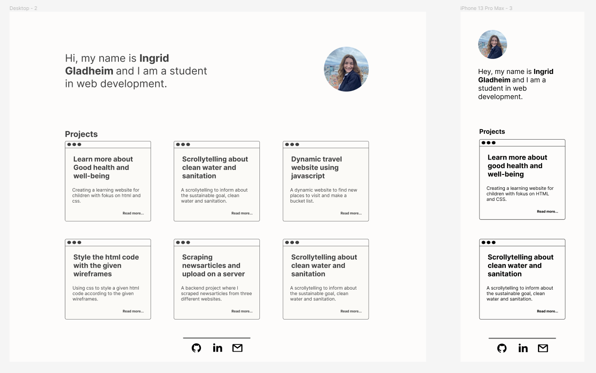

# My portfolio
This is my portfolio, a very easy layout with only a overview of my projects and links to the projects on git. 

## Process
I started the process with making wireframes in figma. I started designing for mobile first, then desktop. After coding I checked my page with the google chrome extension wave to see if it was some errors that would make my website not as accessible. As well checking the after constrast errors. 

## Visit the website
https://ingring.github.io/portfolio/
